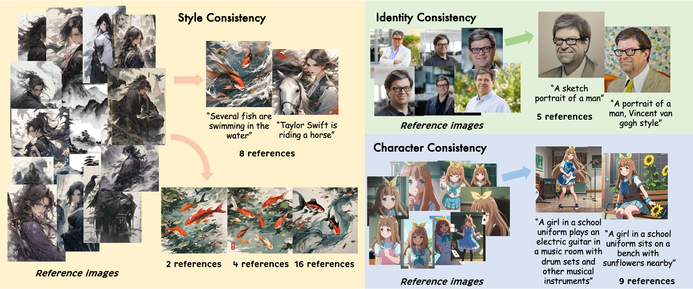

<div align="center">
<h1>EasyRef: Omni-Generalized Group Image Reference for Diffusion Models via Multimodal LLM</h1>

<div class="is-size-5 publication-authors">
            <span class="author-block">
              <a href="https://scholar.google.com/citations?user=vls0YhoAAAAJ">Zhuofan Zong</a ><sup style="color:#6fbf73;">1</sup><sup style="color:#000000;">,</sup><sup style="color:#ffac33;">2</sup>,
            </span>
            <span class="author-block">
              <a href="https://caraj7.github.io">Dongzhi Jiang</a ><sup style="color:#6fbf73;">1</sup>,
            </span>
              <span class="author-block">
                <a href="https://scholar.google.com/citations?user=rcWQWCoAAAAJ">Bingqi Ma</a ><sup style="color:#ffac33">2</sup>,
              </span>
              <span class="author-block">
                <a href="https://songguanglu.github.io/">Guanglu Song</a ><sup style="color:#ffac33">2</sup>,
              </span>
              <span class="author-block">
                <a href="https://hao-shao.com/">Hao Shao</a ><sup style="color:#6fbf73">1</sup>,
              <!-- </span> -->
              <span class="author-block">
                <a href="http://www.shendazhong.com/">Dazhong Shen</a ><sup style="color:#FF69B4">3</sup>,
              </span>
              <span class="author-block">
                <a href="https://liuyu.us/">Yu Liu</a ><sup style="color:#ffac33">2</sup>,
              </span>
              <span class="author-block">
                <a href="https://www.ee.cuhk.edu.hk/~hsli/">Hongsheng Li</a ><sup style="color:#6fbf73;">1</sup><sup style="color:#000000;">,</sup><sup style="color:#FF69B4;">3</sup>
              </span>
          </div>
          <div class="is-size-5 publication-authors">
            <span class="author-block"><sup style="color:#6fbf73;">1</sup>CUHK MMLab,</span>
            <span class="author-block"><sup style="color:#ffac33">2</sup>SenseTime Research,</span>
            <span class="author-block"><sup style="color:#FF69B4">3</sup>Shanghai AI Laboratory</span><br>
          </div>
              

<a href='https://easyref-gen.github.io/'></a>
<a href='https://arxiv.org/abs/2412.09618'></a>
<a href='https://huggingface.co/papers/2412.09618'></a> 
[](https://github.com/TempleX98/EasyRef)
<a href='https://huggingface.co/spaces/zongzhuofan/EasyRef'></a>
<a href='https://huggingface.co/zongzhuofan/EasyRef'></a>
</div>
EasyRef is capable of modeling the consistent visual elements of various group image references with a single generalist multimodal LLM in a zero-shot setting.



## Release
- [2025/04/03] 🔥 The latest EasyRef model (trained January 2025) surpasses the image quality of the previous EasyModel (trained November 2024) and will be open-sourced soon.
- [2025/01/06] 🔥 We release the [gradio demo](https://huggingface.co/spaces/zongzhuofan/EasyRef)!
- [2024/12/13] 🔥 We release the [training code](https://github.com/TempleX98/EasyRef/blob/main/scripts/multi_ref_finetuning.sh), [inference code](https://github.com/TempleX98/EasyRef/blob/main/easyref_demo.ipynb), and [pre-trained model](https://huggingface.co/zongzhuofan/EasyRef)!

## Installation

```
# install requirements
pip install git+https://github.com/TempleX98/EasyRef.git
cd EasyRef
pip install -r requirements.txt

# download the models
git lfs install
git clone https://huggingface.co/zongzhuofan/EasyRef
mv EasyRef checkpoints

# download the basemodel and the multimodal llm
git clone https://huggingface.co/stabilityai/stable-diffusion-xl-base-1.0
git clone https://huggingface.co/Qwen/Qwen2-VL-2B-Instruct

# then you can use the notebook
```

## Demos
More visualization examples are available in our [project page](https://easyref-gen.github.io/).
### Comparison with IP-Adapter


### Compatibility with ControlNet


## Training

EasyRef adopts a progressive training scheme: (1) alignment pretraining stage: facilitate the adaption of MLLM's visual signals to the diffusion model; (2) single-reference finetuning stage: enhance the MLLM's capacity for fine-grained visual perception and identity recognition; (3) multi-reference finetuning stage: enable the MLLM to accurately comprehend the common elements across multiple image references.

### Data Format

You should first organize your training data according to the following format and make your own dataset into a json file.
In this example, the image `1.jpg` serves as the reconstruction target and reference image.
```json
[{
    "image_file": [
        "1.jpg"
    ],
    "text": [
        "A fantasy character."
    ],
    "target": "1.jpg"
}]
```
In this example, we crop the face region of the reconstruction target `1.jpg` using face detection result then use the cropped image as the reference image.
```json
[{
    "face": [
        [[555.5458374023438, 71.08999633789062, 668.3660278320312, 233.39280700683594, 0.9999279975891113]]
    ],    
    "text": [
        "A fantasy character."
    ],
    "target": "1.jpg"   
}]
```
In this example, we select the image `1.jpg` from the group as the reconstruction target and the remaining images are reference images.
```json
[{
    "image_file": [
        "2.jpg",
        "3.jpg",
        "4.jpg",
        "5.jpg"
    ],
    "text": [
        "A fantasy character."
    ],
    "target": "1.jpg"
}]
```
### Alignment Pretraining
We only train the final layer of MLLM, the projection layer, and cross-attention adapters during pretraining. 
We provide the training script [here](https://github.com/TempleX98/EasyRef/blob/main/scripts/alignment_pretraining.sh).

### Single-reference Finetuning
During this stage, we jointly train the MLLM, its final layer, the projection layer, newly-added LoRA layers and cross-attention adapters. The model is initialized with the checkpoint trained by alignment pretraining. We provide the training script [here](https://github.com/TempleX98/EasyRef/blob/main/scripts/single_ref_finetuning.sh).

### Multi-reference Finetuning
We train the same components as the previous stage but use different training data and augmentations. EasyRef is trained on 32 A100 GPUs with 80GB memory using DeepSpeed ZeRO-2. To train on fewer GPUs, you can reduce the `num_processes` in the script and increase the gradient_accumulation_steps accordingly.
We provide the training script with DeepSpeed [here](https://github.com/TempleX98/EasyRef/blob/main/scripts/multi_ref_finetuning.sh).

## Inference
We provide the inference code of EasyRef with SDXL in [**easyref_demo**](https://github.com/TempleX98/EasyRef/blob/main/easyref_demo.ipynb).

### Usage Tips
- EasyRef performs best when provided with multiple reference images (more than 2).
- To ensure better identity preservation, we strongly recommend that users upload multiple square face images, ensuring the face occupies the majority of each image.
- Using multimodal prompts (both reference images and non-empty text prompt) can achieve better results. 
- We set `scale=1.0` by default. Lowering the `scale` value leads to more diverse but less consistent generation results.


## Acknowledgements
- Our codebase is built upon the [IP-Adapter](https://github.com/tencent-ailab/IP-Adapter) repository.
- EasyRef is inspired by [LI-DiT](https://arxiv.org/abs/2406.11831), [IP-Adapter](https://github.com/tencent-ailab/IP-Adapter), [ControlNet](https://github.com/lllyasviel/ControlNet), [InstantID](https://github.com/instantX-research/InstantID), [InstantStyle](https://github.com/instantX-research/InstantStyle), [PhotoMaker](https://github.com/TencentARC/PhotoMaker) and other image personalization methods. Thanks for their great works!

## Disclaimer
This project is released under [Apache License 2.0](https://github.com/TempleX98/EasyRef/blob/main/LICENSE). We release our checkpoints for research purposes only. Users are granted the freedom to create images using this tool, but they are expected to comply with local laws and utilize it in a responsible manner. The developers do not assume any responsibility for potential misuse by users.

## Cite
If you find EasyRef useful for your research and applications, please cite us using this BibTeX:

```bibtex
@article{easyref,
  title={EasyRef: Omni-Generalized Group Image Reference for Diffusion Models via Multimodal LLM},
  author={Zong, Zhuofan and Jiang, Dongzhi and Ma, Bingqi and Song, Guanglu and Shao, Hao and Shen, Dazhong and Liu, Yu and Li, Hongsheng},
  journal={arXiv preprint arXiv:2412.09618},  
  year={2024}
}
```